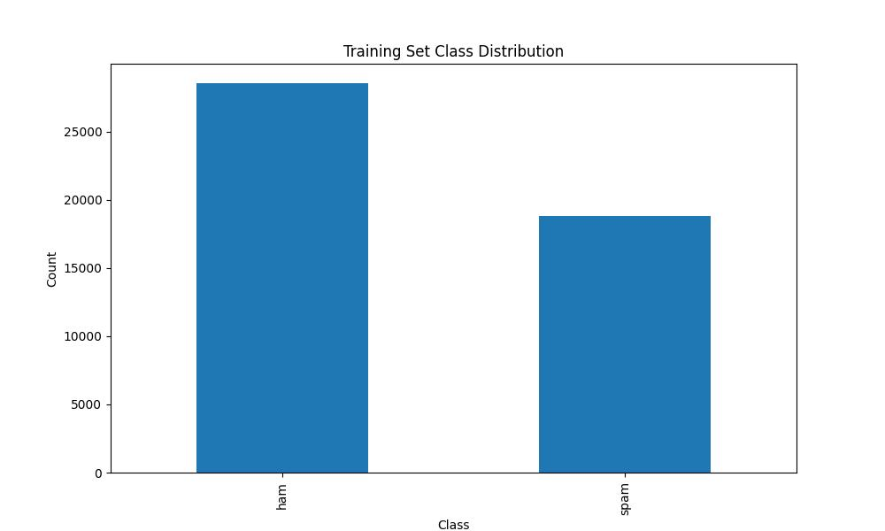
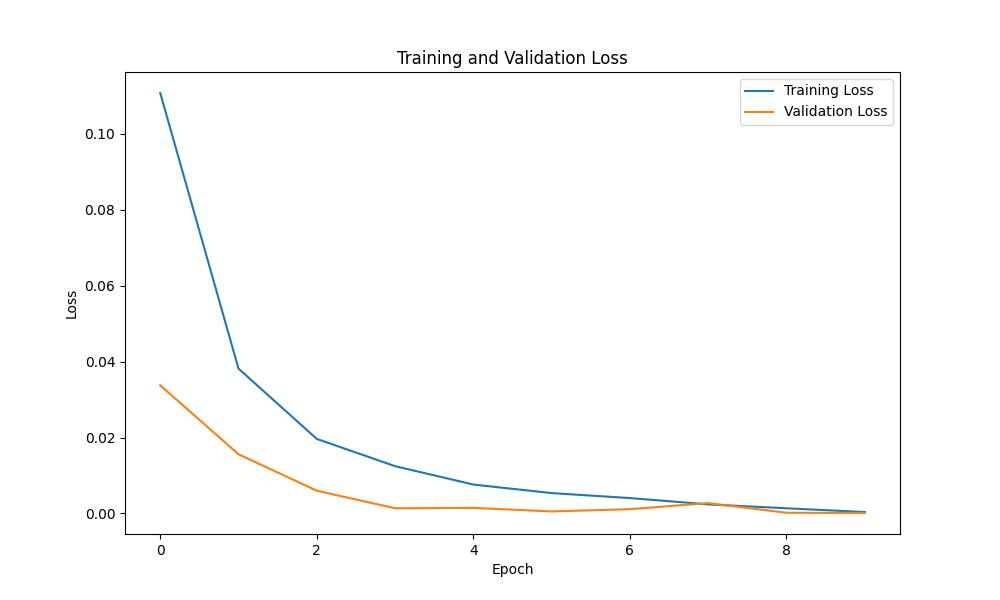
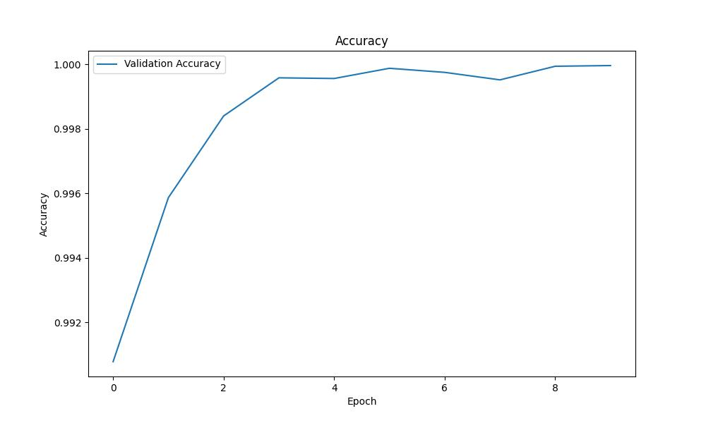
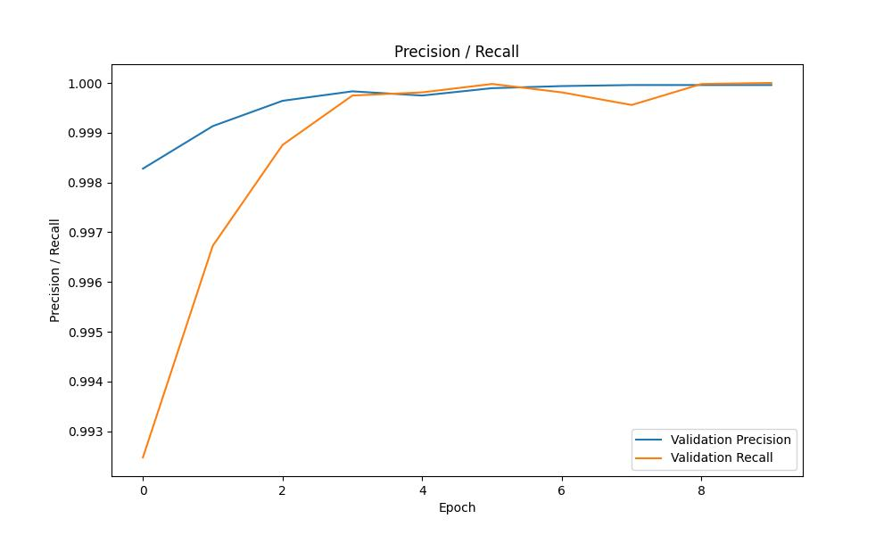

# RoBERTa based Spam Message Detection
Spam messages frequently carry malicious links or phishing attempts posing significant threats to both organizations and their users. By choosing our RoBERTa-based spam message detection system, organizations can greatly enhance their security infrastructure. Our system effectively detects and filters out spam messages, adding an extra layer of security that safeguards organizations against potential financial losses, legal consequences, and reputational harm.

## Dataset
The dataset is composed of messages labeled by ham or spam, merged from three data sources:
1.	SMS Spam Collection https://www.kaggle.com/datasets/uciml/sms-spam-collection-dataset
2.	Telegram Spam Ham https://huggingface.co/datasets/thehamkercat/telegram-spam-ham/tree/main
3.	Enron Spam:  https://huggingface.co/datasets/SetFit/enron_spam/tree/main (only used message column and labels)

The prepare script for enron is available at https://github.com/mshenoda/roberta-spam/tree/main/data/enron.
The data is split 80% train 10% validation, and 10% test sets; the scripts used to split and merge of the three data sources are available at: https://github.com/mshenoda/roberta-spam/tree/main/data/utils.

### Dataset Class Distribution

Training  80%  |  Validation  10%   |  Testing  10%          
:-------------------------:|:-------------------------:|:-------------------------: 
 Class Distribution |  Class Distribution |   Class Distribution


## Model Architecture
The model is fine tuned RoBERTa base 

roberta-base: https://huggingface.co/roberta-base

paper: https://arxiv.org/abs/1907.11692 

my model is hosted at huggingface
roberta-spam: https://huggingface.co/mshenoda/roberta-spam

## Metrics
Loss    |  Accuracy      |  Precision / Recall            
:-------------------------:|:-------------------------:|:-------------------------: 
 Train / Validation |  Validation |   Validation


## Required Packages
- numpy
- torch
- transformers
- pandas
- tqdm
- matplotlib


### Install
```
pip3 install -r requirements.txt
```

## Directory Structure
Place all the files in same directory as the following:
```
├─── data/          contains csv data files
├─── plots/         contains metrics results and plots   
├─── roberta-spam   trained model weights 
├─── utils/         contains helper functions
├─── demo.ipynb     jupyter notebook run the demo 
├─── detector.py    SpamMessageDetector with methods train, evaluate, detect 
└─── dataset.py     custom dataset class for spam messages
```

## Running Demo
To run the demo, please run the following Jupyter Notebook: demo.ipynb

** Recommend using VSCode https://code.visualstudio.com for running the demo notebook
